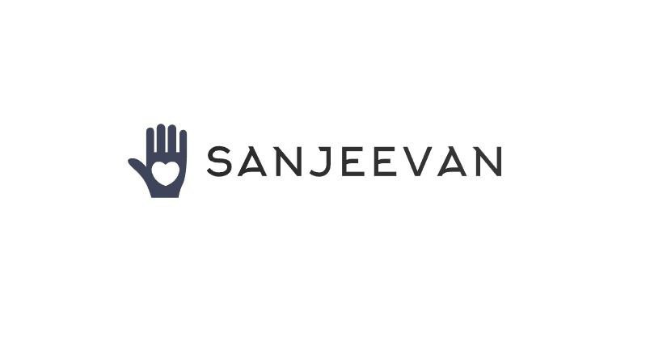

# Sanjeevan

Sanjeevan is a video calling application designed to bridge the communication gap for people who cannot speak. Our mission is to empower individuals with diverse abilities to express themselves freely and connect with others effortlessly. Through innovative technology and machine learning, we aim to create an inclusive world where everyone's voice is heard, regardless of linguistic or physical barriers.

## Features

- **Real-time Video Communication**: Video calling feature to connect users.
- **Hand Gesture Recognition**: Uses AI to detect and interpret hand gestures, translating them into meaningful communication.
- **Sign Language Support**: Includes support for multiple gestures, including common phrases like "Thank You," "I Love You," and "Please."
- **Inclusive Design**: Tailored for individuals with speech impairments, ensuring easy and accessible communication.

## Technologies Used

### Frontend
- **HTML**
- **CSS**
- **JavaScript**

### Backend
- **FastAPI**
- **Uvicorn**

### AI Model
- **Random Forest Classifier**
  - Built using custom and pre-existing datasets to improve model variation.
  - Trained to recognize hand gestures and convert them into text.

### Real-time Communication
- **Agora**: Facilitates video calls and chat functionalities.

## How It Works

The application leverages **MediaPipe** to capture hand landmarks and process them using a trained **RandomForestClassifier** to identify gestures. The hand gestures are mapped to alphabets and common phrases using predefined labels, allowing users to communicate through sign language.

### Key Components

1. **Model**: The gesture recognition model is pre-trained and stored as a pickle file (`model.p`). It predicts hand signs based on MediaPipe's hand landmark detection.
2. **WebSocket**: Real-time communication via WebSockets enables live video streaming and gesture detection.
3. **Video Feed**: Uses OpenCV to capture video frames, process hand gestures, and send predictions in real-time.

## Dataset and Model Training

- **Custom Dataset**: We have utilized and extended an existing dataset for sign language gestures.
- **RandomForest Classifier**: A machine learning model is trained to recognize and classify hand gestures.
- **Labels**: The model is capable of predicting 48 different hand gestures, ranging from alphabets (A-Z) to common phrases like "Thank You," "Yes," "No," "Hello," and more.

## Installation

To get started, follow these steps:

1. Clone the repository:
   ```bash
   git clone https://github.com/vaibhavkothari33/Hackfest.git

## Installation

To install the required dependencies:

```bash
pip install -r requirement.txt
```
##  Run the FastAPI server
```bash
uvicorn app:app --reload
```
## Example Code

Here's an example of how gestures are detected and processed:

```py
results = hands.process(frame_rgb)

if results.multi_hand_landmarks:
    for hand_landmarks in results.multi_hand_landmarks:
        # Process landmarks for gesture prediction
        prediction = model.predict([np.asarray(data_aux)])
        predicted_character = labels_dict[int(prediction[0])]

```
## API Endpoints

### /video-feed: WebSocket endpoint for real-time video and gesture prediction.

## Future Enhancements

- **Multi-language Support**: Expand gesture recognition to support additional sign languages, enabling more users from diverse linguistic backgrounds to communicate seamlessly.

- **Voice Synthesis**: Implement text-to-speech functionality to convert recognized hand signs into spoken words, enhancing the communication experience for individuals who rely on verbal interactions.

- **Improved Model**: Further train the model with larger and more diverse datasets to increase gesture recognition accuracy and prediction speed, making communication faster and more reliable.


## Demo
You can check out sanjeevan at 
https://vaibhavkothari33.github.io/Hackfest/



